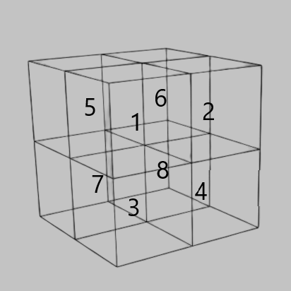

# Barnes Hut Model for Charged Particles

## Description
The Barnes Hut Model is a method for calculating the gravitational force between charged particles. It is a tree-based algorithm that uses a quadtree or octree to calculate the force between particles. The algorithm is described in the paper [A hierarchical O(N log N) force-calculation algorithm](https://www.doi.org/10.1038/324446a0) by Barnes and Hut.

## Required libraries
- GSL

## To-do list

- [x] octree.cpp - Octree data structure
- [x] octree.cpp - Update Center of Mass/Charge
- [x] barnes.cpp - Calculate Force
- [x] simulation_loop.cpp - Calculate Acceleration
- [x] simulation_loop.cpp - Update tree and particle position
- [ ] initialConditions.cpp
- [ ] utils.cpp

## Methodology
### Octree
The octree is a tree data structure that is used to partition space. Each node in the tree represents a cube in space. The root node represents the entire space. Each node has 8 children, which represent the 8 cubes that make up the parent cube. 

The children of a node are only created if the node contains more than one particle. The particles are then distributed among the children. The algorithm for creating the octree is as follows:

1. Create the root node, which represents the entire space
2. When a new particle is added to the tree, check if there is a particle in the root node
   1. If there is no particle in the root node, add the particle to the root node
   2. If there is a particle in the root node, create 8 children for the root node (i.e split the root node into 8 3d octets) and move the particles to the appropriate children
3. Repeat step 2 until all particles are in the tree

The octree allows for us to calculate the force between particles in O(N log N) time. The original equation for the calculation of the force between particles is as follows:
$$F = \frac{Gm_1m_2}{r^2}$$ 
where $G$ is the gravitational constant, $m_1$ and $m_2$ are the masses of the particles, and $r$ is the distance between the particles. The force between particles can be calculated by summing the forces between each particle and all other particles. This is an O(N^2) operation. 

Similarly, for the calculation of the force between charged particles, we can use Coulomb's law which resembles the equation for the gravitational force:
$$F = \frac{kq_1q_2}{r^2}$$
where $k$ is the Coulomb constant, $q_1$ and $q_2$ are the charges of the particles, and $r$ is the distance between the particles. The force between particles can be calculated by summing the forces between each particle and all other particles. This isn also an O(N^2) operation.

### Barnes Hut Simulation
While summing the forces between every particle is an O(N^2) operation, the Barnes Hut Model uses the octree to reduce the number of particles that need to be considered when calculating the force between particles. [The algorithm](http://arborjs.org/docs/barnes-hut) for calculating the force between particles is as follows:
1. If the current node is an external node (and it is not body b), calculate the force exerted by the current node on b, and add this amount to b’s net force.
2. Otherwise, calculate the ratio s/d, where s is the width of the region represented by the internal node, and d is the distance between the body and the node’s center-of-mass. 
3. If s/d < θ, treat this internal node as a single body, and calculate the force it exerts on body b, and add this amount to b’s net force.
4. Otherwise, run the procedure recursively on each of the current node’s children.

The Barnes Hut Model is an O(N log N) algorithm. The value of θ is a parameter that affects the degree of approximation. The smaller the value of θ, the more accurate the simulation is. However, the smaller the value of θ, the longer the simulation takes to run.
